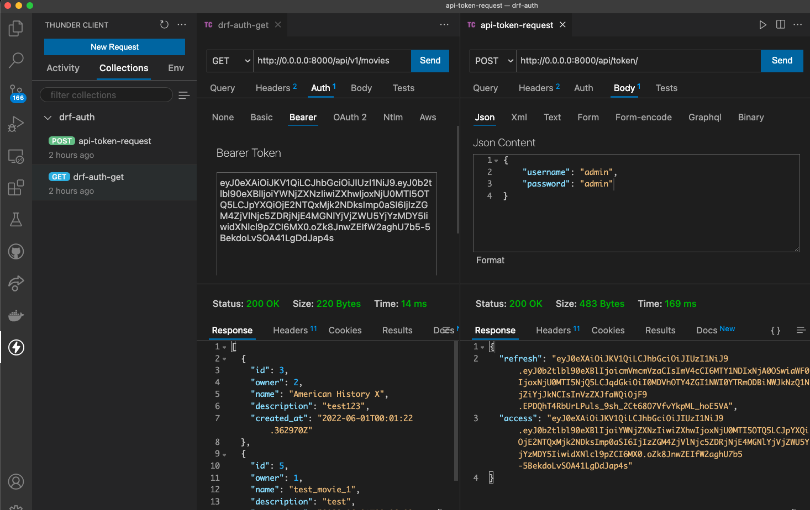

# Project: Permissions & Postgresql

# Feature Tasks and Requirements
# Features - Django
- Add JWT Authentication to your API.
    - Install needed libraries in project configuration and/or site settings.
    - Keep any pre-existing authentication so DRF Browsable API still usable.
        - Install needed libraries in project configuration and/or site settings.
# Features - Docker
- Switch to using Gunicorn instead of Django’s built in development server.
    - mind the number of workers to avoid sluggishness
- Warning You will run into styling issues when you switch over to Gunicorn.
    - On Django side you’ll need to properly handle static files using Whitenoise
# Storage Options
- Your choice of SQLite or PostgreSQL
- Adjust docker-compose.yml so that data is persisted in a volume outside of container.
    - These steps are different depending on whether SQLite or PostgreSQL is being used.

# Steps to manually test(screenshot for thunderclient)

